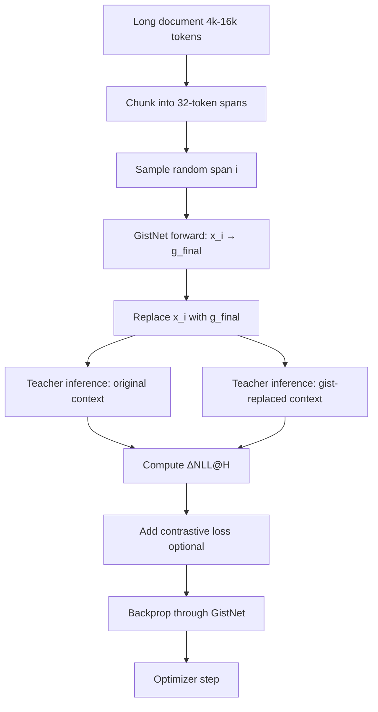

---
tags:
  - components
summary: Complete training methodology for GistNet including loss functions, teacher-student distillation, curriculum strategies, and optimization details.
---
# GistNet Training

Training [[GistNet]] to produce [[substitutability|substitutable]] gist embeddings [1] that preserve the [[LLM]] prediction quality when replacing token spans. The training process uses a frozen teacher model to minimize [[ΔNLL]]@H and optional contrastive losses to ensure distinct gist representations.

## Training Objectives

[[GistNet]] training optimizes for two complementary objectives: **substitutability** (primary) and **contrastive span separation** (optional).

### Primary: Substitutability Loss

The core objective ensures that replacing a 32-token span with its gist embedding causes minimal change in the base [[LLM]]'s output distribution. This is measured via [[ΔNLL]]@H—the change in negative log-likelihood over a prediction horizon H.

**Formal definition:**

```python
# For each training example with tokens x_1, ..., x_T
# Replace span [t:t+32] with gist g_final

Loss_subst = KL( P_base(x_{t+1:T} | E_original)
                 || P_base(x_{t+1:T} | E_replaced) )
```

Equivalently, minimize the [[ΔNLL]] between full and gist-replaced contexts:

```python
# Original context with all tokens
NLL_original = -log P_base(x_{t+32:t+32+H} | x_1, ..., x_{t+31})

# Gist-replaced context
NLL_replaced = -log P_base(x_{t+32:t+32+H} | x_1, ..., x_{t-1}, g_final, x_{t+32}, ...)

# Substitutability loss
Loss_subst = NLL_replaced - NLL_original  # ΔNLL@H
```

**Horizon parameter H:**
- **POC default:** H = 32–128 tokens
- Shorter horizons (32–64): focus on immediate next-token prediction
- Longer horizons (128): encourage preservation of broader semantic context
- Trade-off: longer H → higher compute cost, better semantic fidelity

**Why this works:**
If `g_final` faithfully captures the span's semantic content, the base [[LLM]] should produce nearly identical predictions whether it sees the original 32 tokens or the single gist vector. Minimizing [[ΔNLL]]@H trains [[GistNet]] to encode exactly what the teacher model needs for accurate continuation.

### Secondary: Contrastive Span Separation

Without explicit regularization, [[GistNet]] might collapse all gists to similar vectors (mode collapse). The contrastive loss encourages adjacent spans to maintain distinct representations.

**Formal definition:**

```python
# For spans i and j (typically adjacent in the sequence)
Loss_contrast = max(0, margin - cosine_distance(g_i_final, g_j_final))
```

**Implementation details:**
- **Margin:** 0.2 (gists should differ by at least 20% cosine distance)
- **Span selection:** compare consecutive 32-token spans
- **Weight:** small (0.05) to avoid interfering with substitutability

**Combined loss:**

```python
Loss_total = Loss_subst + λ_contrast * Loss_contrast
```

where `λ_contrast = 0.05` in the POC.

**When to use:**
- Essential for diverse corpora (code, structured data, repetitive text)
- Can be disabled for purely narrative text
- Monitor gist diversity metrics; if std(cosine_similarity) < 0.1, increase λ_contrast

## Teacher-Student Training Architecture

[[GistNet]] training follows a **knowledge distillation** paradigm [2]: a frozen teacher [[LLM]] provides supervision signals, and the student [[GistNet]] learns to compress spans while preserving teacher predictions.

### Teacher Model Setup

**Role:** Compute prediction distributions for [[ΔNLL]]@H evaluation

**Requirements:**
- Same architecture as the target base [[LLM]] (e.g., `HuggingFaceTB/SmolLM3-3B`)
- **Frozen weights:** no backprop through the teacher
- Full precision (fp32) or bf16 for stable logits

**Forward passes per training step:**

```python
# 1. Original context (teacher inference only)
logits_original = teacher_model(x_1, ..., x_T)
probs_original = softmax(logits_original[t+32:t+32+H])

# 2. Gist-replaced context (teacher inference + student backprop)
g_final = gist_net(x_t, ..., x_{t+31})  # Student forward
x_replaced = concat(x_1, ..., x_{t-1}, g_final, x_{t+32}, ..., x_T)
logits_replaced = teacher_model(x_replaced)
probs_replaced = softmax(logits_replaced[t+32:t+32+H])

# 3. Compute KL divergence
Loss_subst = KL(probs_original || probs_replaced)
```

**Memory optimization:**
- Teacher and student run on separate GPU streams
- Cache teacher logits for the original context (no repeat computation)
- Use gradient checkpointing for [[GistNet]] if memory-constrained

### Student Model (GistNet)

**Architecture:** 32→32→1→32→32→1 refinement stack (see [[GistNet#POC architecture]])

**Trainable parameters (LoRA adapters [3]):**
- ~0.5M per compression layer
- 2 shared slot queries (`Q₁`, `Q₂`)
- Self-attention and cross-attention weights
- MLP blocks and layer norms

**Gradient flow:**

```
Loss_subst (from teacher comparison)
    ↓
teacher_model.backward()  [frozen, no weight updates]
    ↓
g_final.backward()
    ↓
gist_net.backward()  [update weights]
```

Only [[GistNet]] weights are updated; the teacher remains frozen throughout training.

## Training Loop and Data Flow

### Per-Example Data Flow



### Training Loop Pseudocode

```python
# POC training loop for GistNet

teacher_model = load_frozen_teacher("SmolLM3-3B")
gist_net = GistNet(window_size=32, embed_dim=4096, num_layers=4)
optimizer = AdamW(gist_net.parameters(), lr=1e-4, weight_decay=0.01)
scheduler = CosineAnnealingLR(optimizer, T_max=num_train_steps)

for epoch in range(num_epochs):
    for batch in dataloader:
        # batch: dict with 'tokens' [B, T] where T ∈ [4096, 16384]

        # 1. Select random 32-token span per example
        span_idx = random.randint(0, T - 32 - H)
        span_tokens = batch['tokens'][:, span_idx:span_idx+32]
        future_tokens = batch['tokens'][:, span_idx+32:span_idx+32+H]

        # 2. GistNet forward: encode span to gist
        span_embeddings = embed(span_tokens)  # [B, 32, d]
        g_final = gist_net(span_embeddings)   # [B, 1, d]

        # 3. Build gist-replaced context
        prefix = batch['tokens'][:, :span_idx]
        suffix = batch['tokens'][:, span_idx+32:]
        context_replaced = concat_with_gist(prefix, g_final, suffix)

        # 4. Teacher inference (no_grad for efficiency)
        with torch.no_grad():
            logits_original = teacher_model(batch['tokens'])
            logits_replaced = teacher_model(context_replaced)

        # 5. Compute ΔNLL@H
        log_probs_orig = log_softmax(logits_original[:, span_idx+32:span_idx+32+H])
        log_probs_repl = log_softmax(logits_replaced[:, span_idx:span_idx+H])

        # Target: teacher predictions on original context
        targets = future_tokens
        nll_original = -log_probs_orig.gather(-1, targets.unsqueeze(-1)).mean()
        nll_replaced = -log_probs_repl.gather(-1, targets.unsqueeze(-1)).mean()

        loss_subst = nll_replaced - nll_original  # ΔNLL

        # 6. Optional contrastive loss
        if use_contrastive:
            g_adjacent = gist_net(embed(batch['tokens'][:, span_idx+32:span_idx+64]))
            cos_sim = cosine_similarity(g_final, g_adjacent)
            loss_contrast = torch.clamp(margin - cos_sim, min=0).mean()
        else:
            loss_contrast = 0

        # 7. Combined loss
        loss = loss_subst + 0.05 * loss_contrast

        # 8. Backprop through GistNet only
        optimizer.zero_grad()
        loss.backward()
        torch.nn.utils.clip_grad_norm_(gist_net.parameters(), max_norm=1.0)
        optimizer.step()
        scheduler.step()

        # 9. Logging
        if step % 100 == 0:
            log_metrics({
                'loss_subst': loss_subst.item(),
                'loss_contrast': loss_contrast.item() if use_contrastive else 0,
                'delta_nll': loss_subst.item(),
                'lr': scheduler.get_last_lr()[0]
            })
```

### Key Implementation Details

**Context assembly:**
- The gist vector `g_final` is inserted at the **central token index** of the replaced span for [[RoPE]] alignment
- Position indices shift: tokens after the gist inherit positions from `span_idx + 32` onward
- Total sequence length reduces by 31 tokens per gist

**Batch processing:**
- Each batch contains long documents (4k–16k tokens)
- Sample one random span per document to avoid GPU memory overflow
- Accumulate gradients across multiple spans if needed (gradient accumulation)

**Teacher caching:**
- Cache `logits_original` for the full document (computed once)
- Only recompute teacher forward pass for `context_replaced`
- Saves ~50% teacher compute per training step

## Curriculum Strategies

Training progresses from simple, homogeneous text to complex, structured data to build robust gist representations.

### Stage 1: Contiguous Narrative (Weeks 1–2)

**Data:**
- Long-form articles, stories, documentation
- Clean, grammatical, semantically coherent
- Examples: Wikipedia, books, arXiv papers

**Goal:** Learn basic compression—encode sentence and paragraph-level semantics

**Metrics to monitor:**
- [[ΔNLL]]@H < 0.5 nats (gist causes minimal prediction degradation)
- Gist diversity: mean cosine distance between adjacent gists > 0.3

**Hyperparameters:**
- H = 32 tokens (short horizon)
- λ_contrast = 0.0 (no contrastive loss yet)
- Learning rate = 1e-4

### Stage 2: Structured Data (Weeks 3–4)

**Data:**
- Code (Python, JavaScript), JSON, tables, lists
- Mixed structure and natural language (e.g., GitHub README with code blocks)

**Goal:** Generalize to non-narrative formats where token-level details matter

**Metrics to monitor:**
- [[ΔNLL]]@H < 1.0 nats (allow slightly higher error for structured data)
- Contrastive gap: ensure consecutive code blocks have distinct gists

**Hyperparameters:**
- H = 64 tokens (medium horizon)
- λ_contrast = 0.05 (enable contrastive loss)
- Add dropout (0.1) to prevent overfitting to code syntax

### Stage 3: Mixed & Adversarial (Week 5+)

**Data:**
- Randomly interleaved narrative + code + tables
- Edge cases: repeated content, noisy text, numerical data
- Adversarial examples: nearly identical spans that should produce different gists

**Goal:** Robust compression across all input types encountered in [[MegaContext Tree]]

**Metrics to monitor:**
- [[ΔNLL]]@H < 0.8 nats (weighted average across text types)
- Zero mode collapse (gist variance > threshold)
- Substitutability rate: % of spans where ΔNLL < 1.0

**Hyperparameters:**
- H = 128 tokens (long horizon for context preservation)
- λ_contrast = 0.08 (stronger regularization)
- Mix data sources: 60% narrative, 30% code, 10% structured

### Curriculum Progression

```
Week 1-2: Narrative only → ΔNLL@32 < 0.5
Week 3-4: Add code/structure → ΔNLL@64 < 1.0
Week 5+:  Mixed adversarial → ΔNLL@128 < 0.8
```

Advance to the next stage only when metrics stabilize (< 5% improvement over 1000 steps).

## Optimization Settings (POC)

### Optimizer Configuration

```python
optimizer = AdamW(
    gist_net.parameters(),
    lr=1e-4,                  # Base learning rate
    betas=(0.9, 0.999),       # Adam momentum terms
    eps=1e-8,                 # Numerical stability
    weight_decay=0.01         # L2 regularization
)
```

**Rationale:**
- AdamW: decouples weight decay from gradient updates (better generalization)
- lr = 1e-4: conservative to avoid instability in early training
- weight_decay = 0.01: light regularization (model is small, ~0.5M params)

### Learning Rate Schedule

```python
scheduler = CosineAnnealingLR(
    optimizer,
    T_max=num_train_steps,     # Total training steps
    eta_min=1e-6               # Minimum LR at end of training
)
```

**Schedule visualization:**

```
LR
 |
1e-4 |     ___
     |    /   \
     |   /     \
     |  /       \___
1e-6 | /            \___
     +-------------------> Steps
     0          T_max
```

**Warmup (optional):**
Linear warmup from 0 to 1e-4 over first 1000 steps to stabilize early training.

### Precision and Hardware

| Setting | Value |
|---------|-------|
| **Precision** | bf16 (bfloat16) |
| **Mixed precision** | Enabled (automatic loss scaling) |
| **Gradient clipping** | max_norm = 1.0 |
| **Batch size** | 8–16 (long documents per batch) |
| **Gradient accumulation** | 4 steps (effective batch size = 32–64) |
| **Hardware** | Single NVIDIA L4 (POC); A100 for production |
| **Training time** | ~24 hours per curriculum stage (L4); ~6 hours (A100) |

**Precision justification:**
- bf16: wider dynamic range than fp16, better for small models
- [[GistNet]] is numerically stable (no extreme activation values)
- Teacher model can run in bf16 for faster inference

### Gradient Clipping

```python
torch.nn.utils.clip_grad_norm_(
    gist_net.parameters(),
    max_norm=1.0
)
```

Prevents gradient explosion when [[ΔNLL]]@H spikes (e.g., teacher produces low-probability predictions).

## Evaluation Metrics

Track these metrics during training and validate on held-out data every 1000 steps.

### Primary Metrics

**1. Mean ΔNLL@H**
```python
delta_nll = nll_replaced - nll_original
mean_delta_nll = delta_nll.mean()  # Target: < 0.5 nats for narrative
```

Lower is better; values > 2.0 indicate poor substitutability.

**2. Substitutability Rate**
```python
substitutability_rate = (delta_nll < 1.0).float().mean()
# Target: > 90% for narrative, > 70% for code
```

Percentage of spans where gist replacement causes minimal degradation.

**3. Perplexity Ratio**
```python
ppl_original = exp(nll_original)
ppl_replaced = exp(nll_replaced)
ppl_ratio = ppl_replaced / ppl_original  # Target: < 1.5
```

Ratio > 2.0 means gists are failing to preserve semantic content.

### Secondary Metrics

**4. Gist Diversity**
```python
# Sample 1000 random gists
gists = [gist_net(sample) for sample in validation_set]
cos_sims = pairwise_cosine_similarity(gists)
mean_diversity = 1 - cos_sims.mean()  # Target: > 0.5
```

Low diversity (< 0.3) indicates mode collapse.

**5. Contrastive Gap**
```python
# Distance between adjacent vs. random span pairs
adjacent_dist = cosine_distance(g_i, g_{i+1})
random_dist = cosine_distance(g_i, g_random)
contrast_gap = random_dist - adjacent_dist  # Target: > 0.1
```

Positive gap confirms contrastive loss is working.

**6. Attention Entropy**
```python
# In GistNet cross-attention layers
attn_probs = softmax(Q @ K^T / sqrt(d))
entropy = -sum(attn_probs * log(attn_probs))
# Target: 2.0–4.0 bits (not too peaked, not too uniform)
```

Monitors whether [[GistNet]] attends uniformly or focuses on key tokens.

### Diagnostic Metrics

**7. Token Reconstruction Error (optional)**
```python
# Expand gist back to tokens via separate decoder
x_reconstructed = decoder(g_final)
mse = mean_squared_error(x_original, x_reconstructed)
```

Not used for training, but helpful for debugging mode collapse.

**8. Hierarchical Consistency**
```python
# For 2-layer GistNet: L0 (32→1) and L1 (32×32→1)
g_L0 = gist_net_L0(tokens[0:32])
g_L1 = gist_net_L1([g_L0_0, ..., g_L0_31])  # 32 L0 gists → 1 L1 gist

# L1 gist should preserve L0 information
delta_nll_L1 = evaluate_substitutability(g_L1, tokens[0:1024])
# Target: L1 ΔNLL < 2.0 (allows some information loss at higher levels)
```

### Validation Protocol

**Frequency:** Every 1000 training steps

**Procedure:**
1. Sample 100 long documents from held-out validation set
2. Compute all metrics above
3. Compare to moving average (EMA over last 10 checkpoints)
4. Early stopping if validation ΔNLL increases for 3 consecutive checks

**Checkpoint saving:**
Save model weights when validation ΔNLL reaches new minimum.

## Training Pipeline Summary

The complete POC training pipeline integrates all components:

### Dataset Preparation

```python
# 1. Collect long-form text (4k–16k tokens per document)
datasets = [
    load_dataset("wikipedia", split="train"),        # 60%
    load_dataset("codeparrot/github-code"),          # 30%
    load_dataset("json-corpus"),                     # 10%
]

# 2. Tokenize with base LLM tokenizer
tokenizer = AutoTokenizer.from_pretrained("SmolLM3-3B")
tokenized = concatenate_datasets(datasets).map(
    lambda x: tokenizer(x['text'], max_length=16384, truncation=True)
)

# 3. Filter by length
filtered = tokenized.filter(lambda x: len(x['input_ids']) >= 4096)

# 4. Split train/val (90/10)
train_data, val_data = filtered.train_test_split(test_size=0.1)
```

### End-to-End Training

```python
# Initialize models
teacher = AutoModelForCausalLM.from_pretrained("SmolLM3-3B").cuda()
teacher.eval()  # Frozen
for param in teacher.parameters():
    param.requires_grad = False

gist_net = GistNet(config).cuda()
gist_net.train()

# Optimizer and scheduler
optimizer = AdamW(gist_net.parameters(), lr=1e-4, weight_decay=0.01)
scheduler = CosineAnnealingLR(optimizer, T_max=100_000)

# Training loop (see pseudocode above)
for step in range(100_000):
    batch = next(train_dataloader)
    loss = train_step(teacher, gist_net, batch, H=32)

    optimizer.zero_grad()
    loss.backward()
    clip_grad_norm_(gist_net.parameters(), 1.0)
    optimizer.step()
    scheduler.step()

    if step % 1000 == 0:
        validate(gist_net, teacher, val_dataloader)
        save_checkpoint(gist_net, step)
```

### Post-Training: Gist Storage

Once trained, [[GistNet]] runs **offline** to populate the [[MegaContext Tree]]:

```python
# Compress entire document history
document_history = load_conversation_history()  # e.g., 100k tokens
gists_L0 = []  # Level 0: one gist per 32 tokens
gists_L1 = []  # Level 1: one gist per 1024 tokens

# Layer 0: 32→1
for i in range(0, len(document_history), 32):
    span = document_history[i:i+32]
    g_L0 = gist_net_L0(embed(span))
    gists_L0.append(g_L0)

# Layer 1: 1024→1 (32 L0 gists → 1 L1 gist)
for i in range(0, len(gists_L0), 32):
    span_gists = gists_L0[i:i+32]
    g_L1 = gist_net_L1(span_gists)
    gists_L1.append(g_L1)

# Store in MegaContext Tree
tree.add_gists(gists_L0, level=0)
tree.add_gists(gists_L1, level=1)
```

These gists are later consumed by [[LensNet]] and [[Focus Allocator]] during the focus loop.

## Key Takeaways

1. **Teacher-student distillation [2]:** [[GistNet]] learns by minimizing [[ΔNLL]]@H, not by reconstructing tokens.
2. **Substitutability is primary [1]:** Gists must preserve the frozen teacher's predictions, not match human intuition.
3. **Contrastive loss prevents collapse:** Small weight (0.05) suffices to maintain gist diversity.
4. **Curriculum matters:** Start simple (narrative), then generalize (code, structure).
5. **Validation is critical:** Monitor ΔNLL, substitutability rate, and gist diversity on held-out data.
6. **Offline compression:** After training, [[GistNet]] runs once to populate [[MegaContext Tree]]; it's not in the inference loop.

## Related Pages

### Parent/Overview Pages
- [[GistNet]] – Parent page: architecture overview and core compression concepts
- [[Training & Operations]] – Broader training infrastructure including alternating optimization
- [[Architecture Details]] – Complete system architecture showing GistNet's role
- [[POC Architecture]] – System-wide architecture and component interactions

### Sibling Detail Pages
- [[GistNet Architecture Details]] – Comprehensive technical specification of the 32→1→32→1 architecture
- [[LensNet Training]] – Training methodology for the companion LensNet model
- [[Tree Operations]] – How trained GistNet is used during tree operations and gist refresh

### Related System Components
- [[MegaContext Tree]] – Storage structure for hierarchical gists produced by trained GistNet
- [[LensNet]] – Consumes trained gists to render focused context during inference
- [[Focus Allocator]] – Uses gist tree populated by trained GistNet to determine span expansion
- [[Working Context]] – Primary consumer of gist embeddings during runtime

### Core Concepts & Metrics
- [[ΔNLL]] – Core evaluation metric: delta in negative log-likelihood for substitutability
- [[substitutability]] – Foundational design principle that drives training objectives
- [[Glossary#Gist / Gist Embedding]] – The compressed representations produced by training
- [[Glossary#L0 / L1 / L2 (Level of Detail / LOD)]] – Hierarchical levels that GistNet trains for

### Implementation Guides
- [[POC Implementation]] – Practical training setup and constraints for the proof-of-concept
- [[Alternating Optimization]] – How GistNet training alternates with LensNet and tree operations
- [[Node Metadata]] – How gist_version metadata tracks training checkpoints

### Operational Integration
- [[Telemetry]] – Metrics collected during and after training
- [[Storage Format]] – How trained gists are stored in binary format
- [[Working Context Assembly]] – How trained gists are assembled into working context

### Examples & Getting Started
- [[Getting Started]] – Initial setup including GistNet training pipeline
- [[Examples]] – Example training runs and validation metrics
- [[How MegaContext Works]] – High-level explanation including training overview

---

## References

1. **Gist Tokens** (Mu et al., 2023) — [[papers/Gist Tokens - 2304.08467v3|Analysis]] — Learned prompt compression via attention masking
2. **Knowledge Distillation** (Hinton et al., 2015) — [[papers/Knowledge Distillation|Analysis]] — Teacher-student framework for GistNet training
3. **LoRA** (Hu et al., 2021) — [[papers/LoRA|Analysis]] — Low-rank adaptation used in GistNet/LensNet training

See [[Related Work]] for the complete bibliography of all research papers referenced throughout the documentation.

---

**Implementation status:** POC training pipeline demonstrated with `HuggingFaceTB/SmolLM3-3B` teacher on single NVIDIA L4. Full curriculum (3 stages) achieves ΔNLL@128 < 0.8 on mixed validation set after ~72 GPU-hours.
