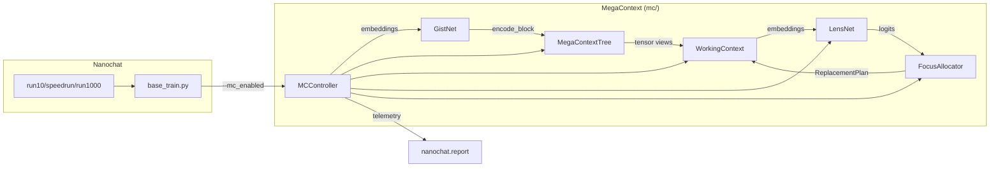

---
tags:
  - plans
summary: Phase-oriented implementation roadmap that translates the POR PRDs into concrete feature/task groupings.
---
# Implementation Roadmap (Nanochat Stack)

> **Purpose:** Bridge the gap between the POR PRDs and day-to-day execution. Each phase lists the capabilities we expect to land together, the dependent features, and concrete tasks/deliverables. Phases build sequentially; later phases assume the earlier layers are stable. Keep [[MegaContext PRD Index]] handy for the POR specs referenced below.

- **Implementation philosophy:** Keep tensor-first data structures—Python classes exist only to manage tensor ops. Avoid “heap fluff” (deep Python object graphs or repeated conversions) so future disk/streaming backends can reuse the same interfaces without refactors.

---

## Phase 1 — Baseline End-to-End (GistNet + LensNet + Focus Allocator + Gaussian RoPE)

Goal: produce a fully nanochat-native training loop that mirrors the legacy POC functionality with modernized infrastructure. The outcome is a single-GPU runnable stack (`run10.sh`) that trains tokenizer → base → mid → chat SFT (per [[MegaContext End-to-End Training]]) and exposes the core [[MegaContext Tree]] / [[Working Context]] mechanics in-memory.

### Capabilities
- **[[GistNet]] compression (32→1, 1024→1)** wired into the nanochat tokenizer/model code.
- **[[LensNet]] focus scoring** with ΔNLL supervision and the existing [[Focus Allocator]] thresholds.
- **[[Working Context]] + [[MegaContext Tree]] (in-memory)** with deterministic ingestion and serialization.
- **[[Positional Encoding#Gaussian RoPE stack|Gaussian RoPE positional encoding]]** integrated via `mc/positional.py` so MegaContext windows respect global positions/LOD-derived variance.
- **Nanochat report + WANDB telemetry** covering ΔNLL@H, swap rate, residency, MFU (per [[Telemetry]]).

### Feature Breakdown
1. **Tokenizer & RoPE Integration** (see [[Positional Encoding#Gaussian RoPE stack]])
   - Introduce the new Gaussian RoPE positional scheme inside `nanochat/gpt.py` with configuration toggles.
   - Persist tokenizer shards + vocab metadata under `$NANOCHAT_BASE_DIR` for reproducibility.
2. **GistNet Module** (per [[GistNet Training]])
   - Embed gist encoder weights alongside the base model.
   - Implement substitutability loss callbacks and logging.
3. **LensNet + Focus Allocator** (per [[LensNet]], [[Focus Allocator]])
   - Add focus-score heads, ΔNLL target extraction, and on-policy perturbations.
   - Hook allocator choices into the Working Context builder.
4. **In-Memory MegaContext Tree** (align with [[MegaContext Tree]] / [[Working Context]] design notes + [[Positional Encoding#Gaussian RoPE stack]] for global positions)
   - Define the core MegaContext Tree interface (tensor-backed, minimal Python wrapper) so disk/streaming backends can drop in later.
   - Deterministic ingestion from raw context → LOD hierarchies with unit tests for expansion/collapse semantics.
5. **Training/Eval Scripts**
   - Keep stock nanochat behavior available via a feature flag (`--mc` or similar). Avoid forking upstream files whenever possible; wrap MegaContext hooks behind the flag as recommended in [[Migration Plan - Nanochat Integration]].
   - Validate `run10.sh` end-to-end (single GPU) with post-run validation.
   - Update [[Training & Operations]] and [[Base Runtime]] with any new flags.

### Component Architecture & Interfaces

| Component | Responsibility | Key Types / Interfaces | Notes |
| --- | --- | --- | --- |
| `mc.structs.MegaContextTree` | Tensor-backed multi-level gist store; canonical view of MC | `MegaContextTree(config, device)` with methods: • `from_tokens(tokens)` → builds LOD hierarchy • `append(token_or_gist)` → incrementally updates affected LODs during inference • `slice(span)` → returns tensor views for focus allocator • `merge(other_tree)` → composable trees All levels stored as dense tensors (shape `[num_nodes, dim]`); IDs are simple `(lod, index)` pairs. | Exposed both in training/inference; streaming backends later implement the same interface. |
| `mc.structs.WorkingContext` | Small active window (L1 cache) assembled from MC tree | `WorkingContext(tree: MegaContextTree, config)` with methods: • `replace(start_idx, count, replacements_tensor, lod)` — generic expand/collapse primitive driven by FocusAllocator • `append(token_or_gist, lod)` (updates WC + LOD tracking tensor) • `to_tensor()` returning contiguous tokens/embeddings for nanochat • `get_lod_tensor()` (CPU tensor storing per-position LOD + global positions) | Stores per-level tensors and CPU-side metadata (lod + global positions). FocusAllocator computes the edits and hands them to `replace`. |
| `mc.modules.GistNet` | Pytorch `nn.Module` for 32→1 compression | Works directly on embeddings/gists (not raw tokens). `forward(embeddings)` returns gist tensors + loss terms; helper utilities (`encode_span`, `compute_substitutability_loss`) operate on tensor inputs. | Registered with nanochat optimizer; usable anywhere embeddings exist. |
| `mc.modules.LensNet` | Pytorch `nn.Module` predicting focus scores | Accepts embeddings/gists from `WorkingContext.to_tensor()`; `forward(wc_embeddings, lod_tensor)` returns logits per span. Helper exposes `score(tree, wc)` returning structured focus objects. | Keeps inference/training parity; ΔNLL target builder remains separate utility. |
| `mc.alloc.FocusAllocator` | Pure-Python controller operating on IDs | Accepts `WorkingContext`, `LensNet` scores, and returns edit plans (expand/collapse) plus metadata for telemetry. | No tensors mutated directly—edits apply through `WorkingContext` methods. |
| `mc.runtime.Controller` | High-level orchestrator bridging nanochat and MC | Methods: • `build_tree(batch)` • `assemble_working_context(tree)` • `inject_into_nanochat(wc_tensor)` | Nanochat scripts call this controller when `--mc` flag set; default path bypasses it entirely. |

**Key principles**
- MC modules never import nanochat internals; nanochat code gains a small shim (e.g., `if args.mc: from mc.runtime import Controller`) so merging upstream changes stays easy.
- Every component exposes both training and inference-friendly methods; we can split finer-grained interfaces later if needed.
- Tensors remain the source of truth; Python objects only coordinate operations and metadata (span IDs, offsets, configs).

### Telemetry
- GistNet substitutability loss, ΔNLL@H per phase, swap/residency stats, Gaussian RoPE stability metrics (see [[Telemetry]] for targets).
- Per-subsystem WANDB panels: GistNet compression ratios, LensNet action histograms, allocator edit counts, tree depth/width, MFU per GPU (mirror [[Training & Operations#4. Telemetry Targets & Alerts]]).

### Deliverables
- Passing `run10.sh` logs + WANDB runs showing ΔNLL@H ≤ 0.10, swap 0.05–0.20.
- Updated docs ([[README]], [[Training & Operations]], [[Base Runtime]]) describing the new features.
- Obsidian notes for Gaussian RoPE, GistNet, LensNet referencing actual code (link back from [[GistNet]], [[LensNet]], [[Positional Encoding]]).

---

## Phase 2 — Structured Attention & Prediction (MegaAttention + MegaPrediction + Hierarchical KV Cache)

Goal: scale beyond the in-memory implementation by enabling hierarchical attention patterns, gist-first decoding, and efficient cache updates. Day-to-day validation stays on `run10.sh --mc`, but keep `speedrun.sh`/`run1000.sh` parity behind feature flags and plan a full `speedrun.sh --mc` run as the phase exit (run1000 reserved for Phase 3 validation). The work items map directly onto [[MegaAttention Training]], [[MegaPrediction Training]], and [[Hierarchical KV Caching Strategy]].

### Capabilities
- **[[MegaAttention Training|MegaAttention]]** masks operating on wLOD trees (pyramidal attention).
- **[[MegaPrediction]] heads** that emit gist tokens ahead of LOD0 tokens (speculative planning).
- **Hierarchical KV caching** to keep attention consistent as the Working Context mutates.
- **Telemetry hooks** for attention sparsity, gist prediction accuracy, and cache hit ratios (extend [[Telemetry]] dashboards).

### Feature Breakdown
1. **Mask Generator & Scheduler**
   - Implement pyramidal mask builder in `nanochat/attention.py`.
   - Add configuration knobs in PRD configs (e.g., `configs/megacontext_e2e.yaml`).
2. **Prediction Head Integration**
   - Extend decoder to output gist logits (LOD1/LOD2) alongside token logits.
   - Provide loss balancing + sampling hooks for the chat CLI.
3. **KV Cache Management**
   - Dirty-range detection when LensNet expands/collapses spans.
   - Cache invalidation + recompute pipeline with metrics.
4. **Evaluation & Tooling**
   - Update `scripts/base_eval` / `scripts.chat_eval` to report MegaAttention and prediction metrics (surface in [[Training & Operations]] / [[Base Runtime]]).
   - Add WANDB panels for cache hits, gist accuracy, sparse attention efficiency.
   - Build compact visualizations for MegaContext Tree + Working Context (e.g., block/line charts showing LOD levels, allocator edits, and focus changes).
5. **Documentation**
   - Cross-link implementation details back to the PRDs.
   - Record operator guides for enabling/disabling MegaAttention/MegaPrediction in Training & Ops.

### Deliverables
- Successful `run10.sh --mc` runs plus at least one `speedrun.sh --mc` trial demonstrating MegaAttention at scale (log links in [[PRD Progress Tracker]]).
- Chat samples demonstrating gist-first predictions (embed in [[Base Runtime]]).
- Updated telemetry dashboards + docs (including MC/WC visualizations) describing how to interpret the new metrics, with references back to [[MegaAttention Training]] / [[MegaPrediction Training]].

---

## Phase 3 — Operational Scale (MegaCuration + Cognitive Core + Composite MegaContexts + Disk-to-GPU Streaming)

Goal: turn MegaContext into a long-lived, disk-backed system capable of running composite memories, automated pruning, and cognitive-core experiments. This aligns with the longer-range requirements in [[MegaCuration PRD]], [[Cognitive-Core Training]], [[Storage Format]], and related ops notes.

### Capabilities
- **[[MegaCuration PRD|MegaCuration]]** pipeline that prunes/compacts tree nodes based on LensNet telemetry and policies.
- **[[Cognitive Core]]** training/eval loop that layers compositional reasoning over the curated trees.
- **Composite MegaContexts** (multiple trees with shared components, e.g., personal + project memories).
- **Disk-to-GPU streaming** for resident working contexts (NVMe/remote storage integration) backed by the MegaCache layer.
- **Automation & monitoring** for curation jobs, streaming logs, and error recovery (documented in [[Training & Operations]] / [[Ops]]).

### Feature Breakdown
1. **Storage, Streaming & MegaCache** (future PRD TBD; keep notes alongside [[Storage Format]])
   - Introduce the **MegaCache**: an intermediate cache residing in system/GPU memory that handles sparse MegaContext pages, prefetch policies, and disk access scheduling (Working Context remains the L1 equivalent).
   - Implement chunked disk formats, async prefetch queues, and cache eviction policies; consider a dedicated PRD if scope grows.
   - Integrate MegaCache APIs with the Working Context loader so focus edits request spans through this layer.
2. **MegaCuration Engine** (per [[MegaCuration PRD]])
   - Define policies (keep/drop, entropy thresholds, budget caps).
   - Background jobs to rewrite trees, emit diffs, and log decisions.
3. **Composite MegaContexts** (extend [[MegaContext Tree]] composition ideas)
   - Support merging multiple tree roots, conflict resolution, and provenance tracking.
   - Extend CLI/Web UI to select active composites.
4. **Cognitive Core Loop** (per [[Cognitive-Core Training]])
   - Training scripts (`scripts/cogcore_train.py`?) leveraging curated trees.
   - Eval harness + telemetry (ΔNLL, reasoning accuracy, focus adherence).
5. **Ops & Tooling**
   - Add curation dashboards, streaming health checks, alerting hooks tied into [[Telemetry]].
   - Document operational runbooks for pruning and long-lived deployments in [[Training & Operations]] / [[Ops]].

### Deliverables
- Demonstrable disk-backed MegaContext with streaming latencies and curation metrics (record in [[MegaCuration PRD]] / [[Storage Format]]).
- Cognitive Core training logs showing gains from composite contexts (summarize in [[Cognitive-Core Training]] and [[PRD Progress Tracker]]).
- Updated docs ([[Ops]], [[Training & Operations]], architecture pages) covering storage formats, curation policies, and runtime procedures.

### Telemetry
- Streaming metrics: disk read latency, queue depth, cache warm rates.
- Curation signals: nodes kept/dropped, pruning decisions per policy, tree size over time.
- Cognitive Core performance: reasoning accuracy, ΔNLL changes when swapping composites, focus adherence metrics.

---

## Phase 4 — Scale-Up & Ecosystem (1B Cognitive Core + LoRA-based MC + Marketplace & Services)

Goal: move from prototypes to production-scale systems and ecosystem tooling. This phase delivers larger Cognitive Core models, adapts pretrained bases via LoRA, and launches external-facing services (marketplace, automation hooks) envisioned in [[Future Plan#Track A — Platform Maturation & Ecosystem]], [[Future Plan#Track B — Advanced Learning & Co-Optimization]], and [[Grand Vision]].

### Capabilities
- **1B-parameter Cognitive Core** trained on ≥1T tokens, leveraging curated MegaContexts (aim for `speedrun`/`run1000` scale or larger clusters).
- **MegaContext retrofitting via LoRA adapters** for popular pretrained bases (e.g., Qwen, LLaMA) so users can “MC-ize” existing checkpoints.
- **MegaContext Marketplace & backend** for sharing/selling curated knowledge bases.
- **Dynamic MC services** (e.g., filesystem watcher, API ingesters) that continuously update MegaContexts.

### Feature Breakdown
1. **Scale-Up Training** (extend [[Cognitive-Core Training]] + [[MegaContext End-to-End Training]] configs)
   - Extend training scripts/configs for 1B+ parameter Cognitive Core runs (multi-node).
   - Harden data pipelines, sharding, and WANDB dashboards for trillion-token regimes.
2. **LoRA-Based Retrofitting** (ties into future LoRA retrofit PRD; reference [[MegaContext End-to-End Training#Adapters]] if/when added)
   - Provide tooling (`scripts/mc_lora_convert.py`?) that trains/attaches MegaContext adapters to pretrained bases.
   - Ship reference configs for popular checkpoints and document expected hardware.
3. **Marketplace Platform** (mirrors [[Future Plan#Track A — Platform Maturation & Ecosystem]])
   - Backend: catalog storage, metadata, access control, billing hooks.
   - Frontend: web UI to browse/download/purchase MegaContexts, plus API endpoints.
4. **Dynamic MC Services** (per [[Future Plan#Track C — Application Showcases & Verticalization]])
   - Build daemon-style services (filesystem watcher MC, email/Slack ingest, etc.) that stream updates into MegaCache/MegaContext.
   - Define auth/provenance and conflict-resolution rules for live updates.
5. **Operational Tooling**
   - CI/regression tests covering LoRA conversion, marketplace ingestion, and service health.
   - Monitoring for marketplace usage, service SLAs, and large-scale training jobs.

### Telemetry
- Training scale metrics: tokens processed, throughput, MFU, loss curves for 1B runs (log via [[Telemetry]] + WANDB).
- LoRA integration stats: adapter parameter counts, ΔNLL deltas vs base, inference latency impact (tie into retrofit PRD once drafted).
- Marketplace/service metrics: download counts, uptime, ingest latency, watcher event rates (report in future [[Ops]] notes).
- Dynamic MC correctness: validation hooks ensuring live updates don’t corrupt focus/curation states (share playbooks in [[Training & Operations]] / [[Base Runtime]]).

### Deliverables
- Public demo of a 1B Cognitive Core trained on ≥1T tokens with reproducible configs (documented in [[Cognitive-Core Training]] + [[PRD Progress Tracker]]).
- Tooling + docs for MC-izing pretrained models via LoRA (link from new retrofit guide / [[Training & Operations]]).
- Live MegaContext marketplace and at least one dynamic MC service (e.g., filesystem watcher) running in production (document in [[Future Plan]] / [[Ops]]).
- Updated PRDs / Ops notes detailing support and maintenance expectations (potentially new POR covering marketplace/services).

---

## Cross-Phase Notes
- **Testing & Validation:** Each phase should add automated smoke tests (Phase 1: run10.sh dry run; Phase 2: speedrun.sh subset; Phase 3: curation/streaming tests) plus WANDB dashboards.
- **Documentation:** Keep [[TODO]] updated as tasks move between phases; ensure [[Training & Operations]] / [[Base Runtime]] reference only shipped commands.
- **Dependencies:** Phase 2 builds directly on Phase 1 artifacts; Phase 3 depends on the telemetry emitted in Phase 2.

> **Implementation style:** Keep code close to the metal—tensors store the data, and Python types should be thin wrappers that expose operations on those tensors. Avoid proliferating bespoke Python structures or serializing/deserializing between them; this keeps performance predictable and makes future streaming backends easier to layer in.
