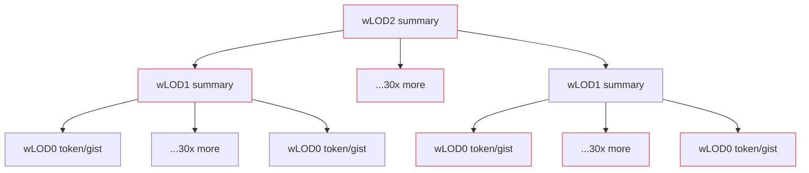

---
tags:
  - plans
  - prd
summary: Introduces MegaAttention, a hierarchical attention pattern over the working-context wLOD tree that unifies prediction heads and long-context scaling.
---
# MegaAttention: Multi-Scale Hierarchical Attention over Working-Context Trees (v3)

## Overview

**MegaAttention** extends the [[MegaContext]] framework into the **attention mechanism itself**, enabling efficient long-context reasoning through hierarchical, multi-level representations derived from the same [[GistNet]] used to build the [[MegaContext Tree]].

> **Status:** Plan of record (POR). Implementation details live in this PRD; the legacy POC notes are historical context only.

Instead of attending over a flat token sequence, the transformer operates over the **[[Working Context]] (WC) tree** composed of multiple **levels of detail (wLOD0, wLOD1, wLOD2, ...)** assembled by [[LensNet]] + the [[Focus Allocator]].
Each higher level summarizes a broader temporal span, allowing each token to reach across long sequences through **coarse-to-fine summaries** — all within near-linear time complexity.

---

## The Long-Context Tradeoff

Long-context modeling has several major paradigms, each with tradeoffs:

| Approach | Global Reach | Efficiency | Info Propagation | Notes |
|-----------|---------------|-------------|------------------|-------|
| **Full Attention** | ✓ | ✗ (O(N²)) | Instant (1 hop) | Exact but scales poorly beyond 32k |
| **Sparse / BigBird / Longformer** | Partial | ✓ | Multi-layer diffusion | Needs multiple layers for long-range mixing (see [[Sparse Transformers]] lineage) |
| **Linear Attention / Performer** | Approximate | ✓✓ | 1 hop (kernel-projected) | Loses precision; harder to interpret (cf. [[reference/papers/Perceiver - 2103.03206v2.md|Perceiver]]/kernel LMs) |
| **SSM / Mamba-style** | Sequential memory | ✓✓ | Global in 1 step | High efficiency, implicit representation |
| **MegaAttention (this)** | ✓ | ✓ | Global per layer via hierarchy | Combines structured efficiency with explicit summarization |

MegaAttention complements, not replaces, the above — offering the **explicit structure of full attention** with the **efficiency of hierarchical sparsity**.
It integrates directly with [[MegaPrediction]] and [[MegaPrediction Training]], leveraging the same **[[GistNet]] summaries**.

---

## Core Idea

MegaAttention builds a **hierarchical attention mask** where the *detail of attention decreases with temporal distance*, borrowing intuitions from [[reference/papers/Perceiver IO - 2107.14795v3.md|Perceiver IO]] and [[reference/papers/Slot Attention - 2006.15055v2.md|Slot Attention]] while keeping transformer compatibility.

Each token attends in full detail to nearby tokens, then transitions to attending **summaries (wLOD1, wLOD2, ...)** representing increasingly coarse spans farther back in time.
Unlike the LensNet (which learns focus), this is a **fixed, deterministic attention structure** — a “diminishing detail with distance” rule.

---

## Conceptual Structure

### The Working Context Tree

Each working context (WC) is a mixture of tokens and gists (LOD0–LOD2) selected by the [[Focus Allocator]].
From these, MegaAttention builds a **block-aligned hierarchy** using the same [[GistNet]] operators that populate the [[MegaContext Tree]].

```
wLOD2 (summaries of 1024-token spans)
   ├── wLOD1 (summaries of 32-token spans)
   │     ├── wLOD0 (mixed-LOD leaves from Focus Allocator)
   │     └── wLOD0 ...
   └── wLOD1 ...
```

This allows any token to see both **fine-grained local context** and **coarse global summaries** in the same layer.

---

## Hierarchical Attention Pattern

Each token's attention pattern follows a structured rule:

```
Near range  →  Full-detail attention to wLOD0 tokens (±W)
Mid range   →  Attend to wLOD1 summaries representing those spans
Far range   →  Attend to wLOD2 summaries (and optionally wLOD3+)
```

This yields a **pyramidal attention pattern**, where every query covers the full temporal range — but the level of detail decays with distance and keeps cache maintenance manageable via [[Hierarchical KV Caching Strategy]].

---

### Comparison to BigBird-style Hybrid Attention

MegaAttention is conceptually similar to hybrid sparse attention, but replaces “fixed pattern” sparsity with **hierarchical structure**:

- **Local window:** dense full attention over nearby wLOD0 tokens.
- **Hierarchical range:** distant tokens attended via wLOD1/wLOD2 summaries.
- **Random edges:** optional random edges for diversity.
- **Global slots:** optional CLS/task/global summary nodes.

---

### Mermaid Diagram (fixed syntax)



Each wLOD0 token routes its attention through wLOD1/wLOD2 summaries representing progressively larger temporal spans.  An example attention path for the last wLOD0 is outlined red.

---

## Visualization (Pyramidal Attention Intuition)

```
  Time              ←past present│ future→
   ├○○○○○○○○○□□□□□□□□□□□■■■■■■■■■■xxxxxxxxxxxxxxxxxx
   │← wLOD2 →│← wLOD1 →│← wLOD0 →│← causal mask →│
   ■ = full-detail attention
   □ = attends via wLOD1 summaries
   ○ = attends via wLOD2 summaries
   x = no attention due to causal mask
```


## Causality

MegaAttention near causality.  Attention between wLODn and wLODn-x is fully causal, however attention between wLODn and wLODn+y is potentially semi-non-causal.  We don't attend to fully future wLODn+y however, if we're attending to a distant past entry at a higher wLOD level, the time range of that wLOD may overshoot the present token.

Optionally, we could limit how high up the wLOD attention is allowed to go to prevent this, to keep things strictly non-causal.

## Gaussian RoPE with Scale Encoding

See [[Positional Encoding#Gaussian RoPE stack]] for the full POR-aligned positional plan.

Each node (token or gist) encodes both **temporal position** and **scale**:

- `t`: mean timestamp or center token position
- `σ`: span width (corresponding to level-of-detail)

Rotary embeddings ([[RoPE]]) are modulated by `σ` — coarse summaries rotate slower (lower frequency) than fine tokens, enabling cross-level alignment in line with [[Positional Encoding#Gaussian RoPE stack|Gaussian RoPE]].
This provides a smooth and differentiable mapping between detailed and summarized positions.

---

## Attention Mask Behavior for Higher wLOD Levels

All wLOD levels are passed through the transformer — not just wLOD0.
Each level attends according to its scale:

- **wLOD0 (leaves):** attends to local tokens and summaries for distant spans.
- **wLOD1 (intermediate summaries):** attends using the same mask pattern as its *last child's mask*, meaning it looks at the same near/mid/far ranges — but its “local” now spans summaries instead of tokens.
- **wLOD2 (global summaries):** attend to all wLOD1 summaries and optionally some wLOD0 tokens near their temporal window.

This hierarchical consistency ensures multi-scale context propagation and enables each level to maintain temporal coherence.

---

## Time Complexity


For each level **i**:
- Each token attends to a local window of size `W`, plus one or more summary node per higher scale.
- The number of levels is log₍r₎N (e.g., ~3 for 32× compression).

Thus total complexity is approximately:

```
O(N·(W + log N)) for wLOD0 +
O(N/r · (W + log N)) for wLOD1 +
O(N/r² · (W + log N)) for wLOD2 + ...
≈ O(N·(W + log N)) overall.
```

This remains **subquadratic and scalable**, while every layer covers the entire temporal range.

---

## Integration with GistNet

MegaAttention **reuses the same [[GistNet]]** that builds the lifetime [[MegaContext Tree]] skill.

At each training step:
1. The Focus Allocator defines the mixed-LOD working context.
2. GistNet computes block-aligned summaries (wLOD1, wLOD2).
3. The transformer consumes all wLOD levels simultaneously.
4. The hierarchical mask enforces fixed pyramidal connectivity.

This ensures **tight coupling** between long-term ([[MegaContext Tree]]) and short-term (MegaAttention) structures, letting [[LensNet]] drive a single refocus loop.

---

## Unified Prediction Head (MegaPrediction Integration)

MegaAttention integrates directly with **[[MegaPrediction]]** through a **single shared readout** across LOD levels: reuse the LM head on the latest final hidden state at each wLODn (no bespoke auxiliary heads).

| Level | Predicts | Ground Truth Source | Loss |
|--------|-----------|----------------------|------|
| **wLOD0** | Next token | Next GT token | Cross-entropy (NLL) |
| **wLOD1** | Next 32-token gist | GistNet summary over next 32 GT tokens | Cosine / MSE |
| **wLOD2** | Next 1024-token gist | GistNet summary over next 1024 GT tokens | Cosine / MSE |

⚠️ Note: the wLOD2 loss is **not** computed recursively from predicted wLOD1s — it's derived from fresh ground-truth gists over the upcoming 1024 tokens, matching the [[MegaPrediction Training]] supervision recipe.

---

## Forward Pass Summary

```text
1. Input mixed-LOD working context (wLOD0) from the [[Focus Allocator]].
2. Compute wLOD1 and wLOD2 summaries via [[GistNet]].
3. Construct hierarchical (pyramidal) attention mask:
     - Full attention for nearby tokens.
     - Coarse summaries for mid/far spans.
4. Apply [[Positional Encoding#Gaussian RoPE stack|Gaussian RoPE]] (time + scale).
5. Run transformer over combined sequence (wLOD0–wLOD2).
6. Each wLOD level attends per its mask.
7. Read final hidden states from latest nodes at each LOD (shared LM head).
8. Compute multi-LOD losses and backprop through base + [[GistNet]].
```

## Key Benefits

- **Global reach in every layer** through hierarchical connectivity.
- **Efficiency**: near-linear cost with multi-scale coverage.
- **Explicit structure:** deterministic, interpretable attention patterns.
- **Unified loss and prediction** integrated with MegaPrediction.
- **Reuses GistNet** — no additional models.

---

## Implementation Plan

1. **Mask generator:** produce deterministic pyramidal masks for each wLOD level.
2. **GistNet reuse:** compute wLOD1/wLOD2 directly in WC.
3. **[[Positional Encoding#Gaussian RoPE stack|Gaussian RoPE]] extension:** encode (t, σ) for scale-aware positions.
4. **Multi-LOD forward:** include all wLOD levels in transformer.
5. **Single unified head:** produce predictions per wLOD.
6. **Training config:** r = 32, W = 256, two-level hierarchy for POC.
7. **Benchmark:** compare MegaAttention vs. BigBird vs. linear attention on equal compute.
8. **Kernel integration:** wire [[Flash Attention]] (v2/3) kernels for each wLOD slice to keep throughput near the frozen baseline.

---

## Expected Outcomes

1. Comparable or better accuracy to sparse/linear attention.
2. Subquadratic runtime scaling on long sequences (256k+).
3. Unified framework across attention, prediction, and context compression.
4. Enhanced interpretability and multi-scale reasoning.
